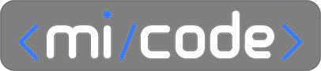

<p align="center">
  
</p>

<h1 align="center">
  📰 Meu Portfólio 2023
</h1>

<p align="center">
  
  
  
  
  
</p>

## 💻 Sobre

Este é o site do meu portfólio pessoal, apresentando alguns de meus projetos, habilidades e experiências como Dev.

<p align="center">
  
</p>

---
O projeto está disponível para visualização em https://micode-dev.vercel.app. <br>
A documentação dos componentes está disponível para visualização em https://micode-dev-book.vercel.app.

---

### 🚀 Tecnologias

O projeto foi desenvolvido com as seguintes tecnologias:

- [NextJS](https://nextjs.org/)
- [Stitches](https://stitches.dev/)
- [TypeScript](https://www.typescriptlang.org/)
- [Jest](https://jestjs.io/)
- [React Testing Library](https://testing-library.com/docs/react-testing-library/intro)
- [framer-motion](https://www.npmjs.com/package/framer-motion)
- [Prettier](https://prettier.io/)
- [Storybook](https://storybook.js.org/)
- [Eslint](https://eslint.org/)
- [husky](https://github.com/typicode/husky)
- [i18next](https://www.i18next.com/)
- [date-fns](https://date-fns.org/)
- [react-three](https://www.npmjs.com/package/@react-three/drei)
- [kbar](https://www.npmjs.com/package/kbar)
- [lottie-react](https://lottiereact.com/)
- [react-icons](https://react-icons.github.io/react-icons/)
- [zustand](https://zustand-demo.pmnd.rs/)
- [commitlint](https://www.npmjs.com/package/commitlint)
- [plop](https://plopjs.com/)

---

### ▶️ Executando o projeto

Siga os seguintes passos para poder utilizar a aplicação em sua máquina.

1. Clone a aplicação em sua máquina local com os seguintes comandos:

```bash
git clone https://github.com/micheldslive/micode-dev.git
```

2. Depois, vá até o diretório do seu projeto utilizando o comando

```bash
cd micode-dev
```

3. Instale as dependências:

```bash
pnpm install
```

4. Rode sua aplicação em sua [conexão local](http://localhost:3000)

```bash
pnpm install
```

---

## ▶️ Executando o projeto (Docker)

##### Com o Docker devidamente instalado e o repositório Clonado, Execute o comando abaixo:

```bash
docker compose up
```
---

### 📚 Design System
 Os principais componentes da aplicação foram documententados. Para acessá-los em sua máquina, rode o seguinte comando:

```bash
pnpm storybook
# ou
yarn storybook
```
---
### 📚 Testes
Para realizar os testes rode os seguinte comando

```bash
pnpm test
# ou
yarn test
```
---

## 💻 Desenvolvedor<br>

<table>
  <tr>
    <td align="center">
      <a href="https://github.com/micheldslive">
        <br>
        <sub>
          <b>Michel Domingos</b>
        </sub>
      </a>
    </td>
  </tr>
</table>

### 🖊️ Licença

O projeto é licenciado sobre a "MIT License" - Veja a pagina LICENÇA para mais destalhes.